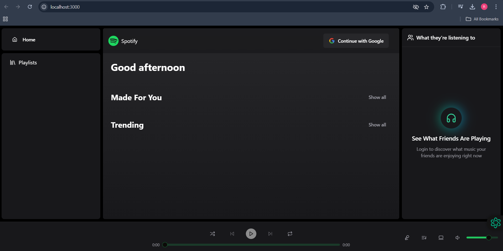
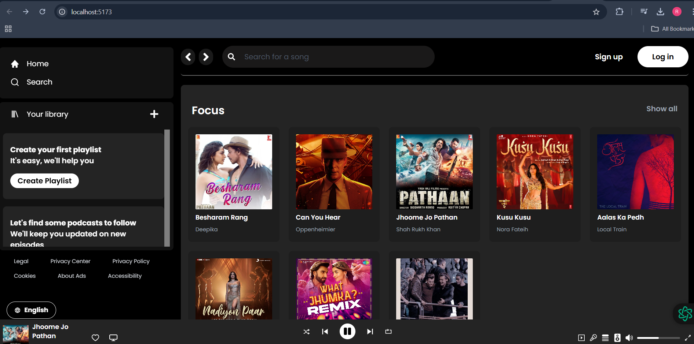
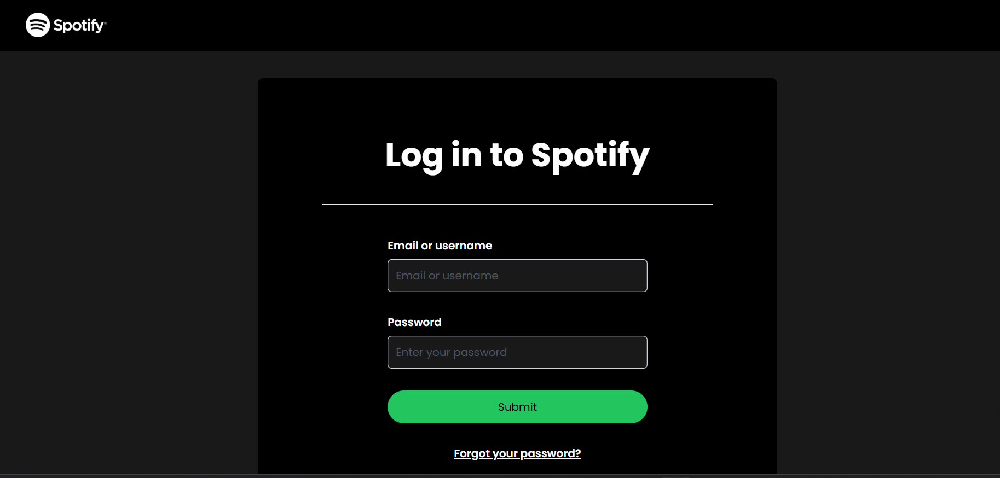

# AudioWave - Spotify Clone

AudioWave is a feature-rich music streaming platform inspired by Spotify. It offers users the ability to stream, explore, and manage music collections. This project includes a fully functional backend and frontend, ensuring a seamless user experience.

---

## Features

### User Authentication
- **JWT-based Authentication**: Secure login and signup functionalities.
- Password encryption for user safety.

### Music Management
- **Stream Music**: High-quality audio playback.
- **Playlist Creation**: Users can create and manage playlists.
- **Music Search**: Quickly find songs by title, artist, or genre.

### User Data
- Stores user preferences and playback history in a MongoDB database.

### Responsive Design
- Optimized for both mobile and desktop devices.

---

## Technologies Used

### Frontend
- **React.js**: For building the user interface.
- **Redux**: For state management.
- **CSS3**: For responsive and modern styling.

### Backend
- **Node.js**: Server-side logic.
- **Express.js**: Web framework for API development.
- **JWT**: Secure user authentication and session management.

### Database
- **MongoDB**: For storing user data, playlists, and song information.

---

## Installation

### Prerequisites
1. **Node.js**: Install from [Node.js official website](https://nodejs.org/).
2. **MongoDB**: Install MongoDB or use a cloud instance (e.g., MongoDB Atlas).
3. **npm or yarn**: For managing dependencies.

---

### Steps to Run Locally

1. **Clone the Repository**:
   ```bash
   https://github.com/Rajeshaligeti/AudioWave.git
   cd AudioWave
   ```

2. **Install Dependencies**:
   - For the backend:
     ```bash
     cd backend
     npm install
     ```
   - For the frontend:
     ```bash
     cd frontend
     npm install
     ```

3. **Setup Environment Variables**:
   Create a `.env` file in the `backend` directory with the following keys:
   ```
   MONGO_URI=<Your MongoDB connection string>
   JWT_SECRET=<Your secret key>
   ```

4. **Run the Application**:
   - Start the backend server:
     ```bash
     cd backend
     npm start
     ```
   - Start the frontend server:
     ```bash
     cd frontend
     npm start
     ```

5. **Access the Application**:
   Open [http://localhost:3000](http://localhost:3000) in your browser.

---

## Folder Structure
```
AudioWave/
├── backend/
│   ├── controllers/
│   ├── models/
│   ├── routes/
│   ├── utils/
│   ├── app.js
│   └── package.json
├── frontend/
│   ├── src/
│   │   ├── components/
│   │   ├── pages/
│   │   ├── redux/
│   │   └── App.js
│   └── package.json
└── README.md
```

---

## Screenshots

### Home Page


### Playlist Creation


### Music Player


### Login Page


---

## License

This project is licensed under the [MIT License](LICENSE). Feel free to use and modify it as per your needs.

---
